# LinkPro - Plateforme de Mentorat pour Étudiants Ingénieurs


---

## Informations du Groupe

**Nom du Groupe:** [Linkro]

### 👥 Membres de l'Équipe

| Membre | Rôle | Page Personnelle |
|--------|------|------------------|
| **Binome 1** | Développeur Frontend / Designer UI/UX | [Voir la page](https://linkpro-puce.vercel.app/index.html) |
| **Binome 2** | Développeur Frontend / Designer UI/UX | [Voir la page](https://linkpro-puce.vercel.app/all-projects.html) |
| **Binome 3** | Développeur Frontend / Designer UI/UX | [Voir la page](https://linkpro-puce.vercel.app/homechat/homechat.html) |

---

## 📸 Captures d'Écran des Pages des Membres

### Pages de [Binome 1]
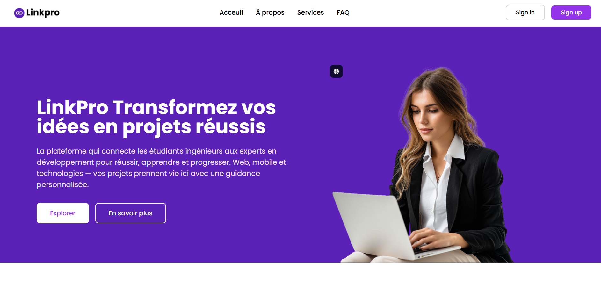
*Description: Landing page linkpro*

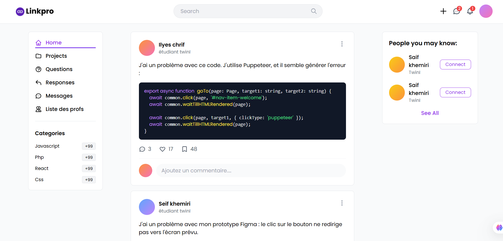
*Description: Home page linkpro*

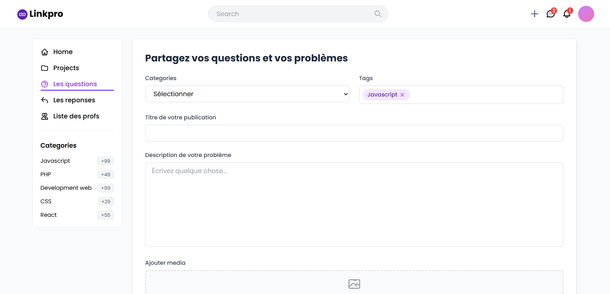
*Description: Page de creation de post*

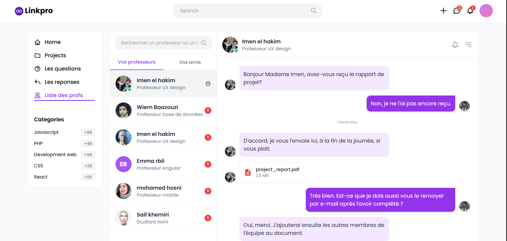
*Description: Page de chat*

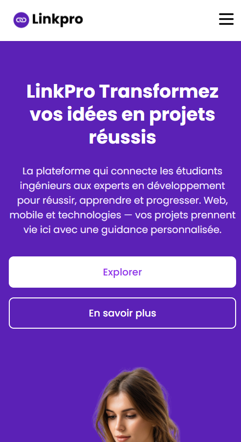
*Description: Responsive mode*

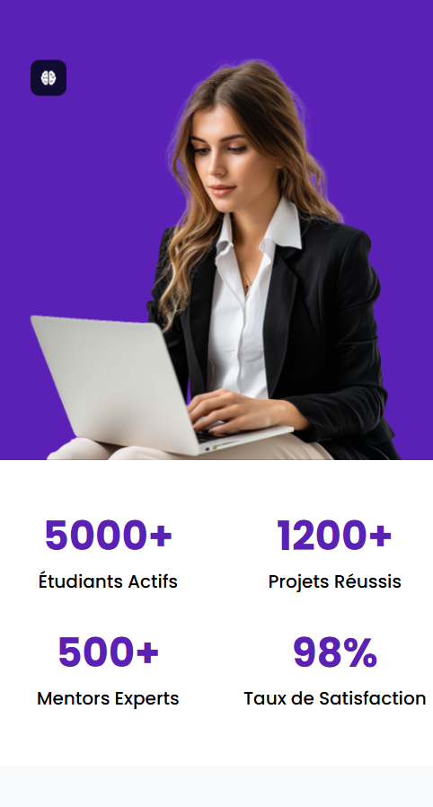

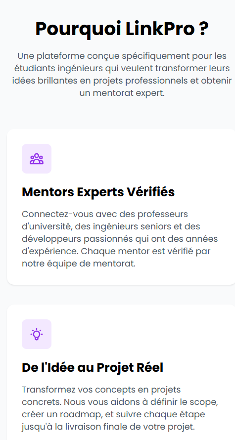

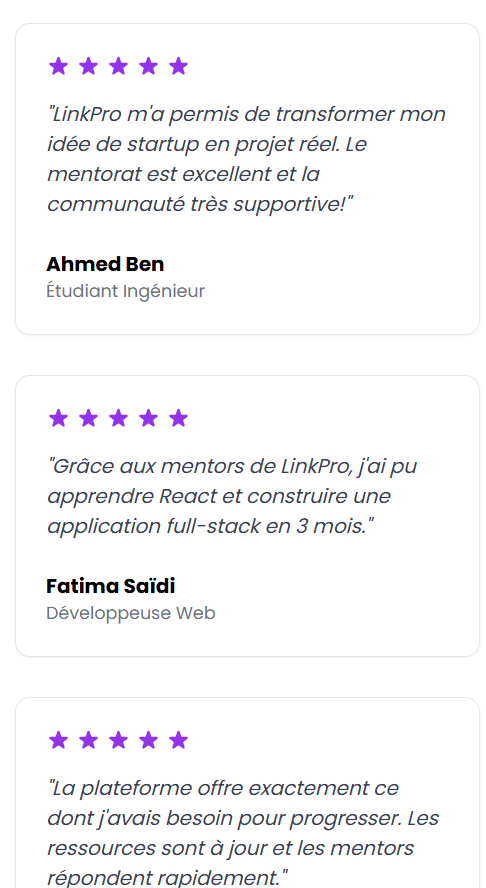

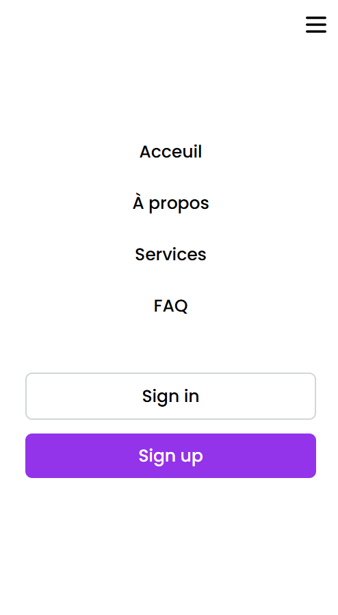

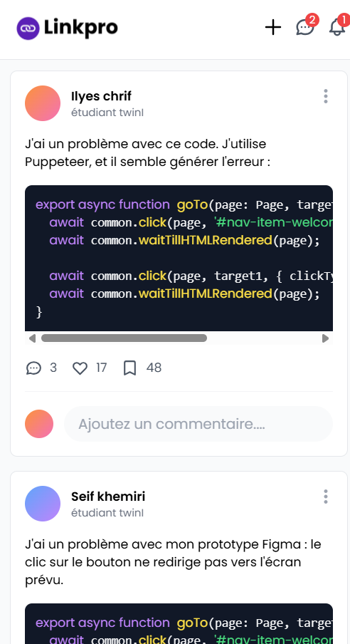

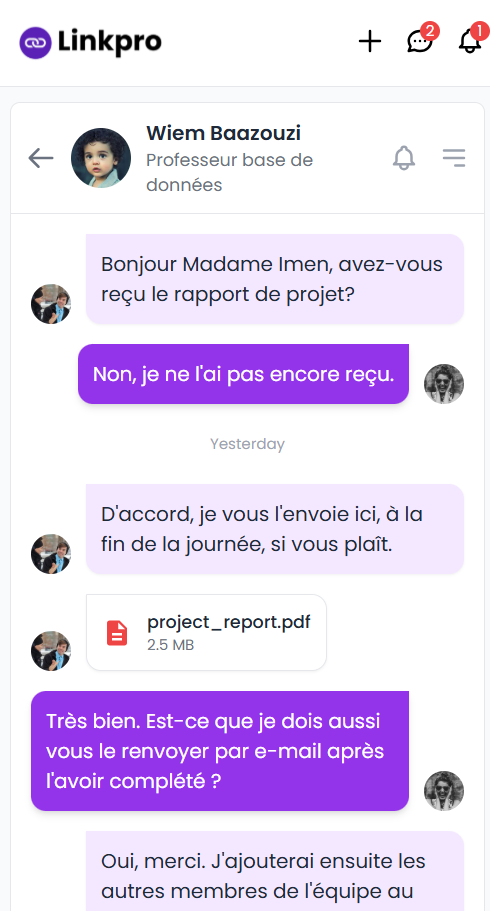


### Page de [Binome 2]

*Description: Portfolio de [Nom Membre 2] avec ses réalisations en design UI/UX.*

### Page de [Binome 3]

*Description: Profil technique de [Nom Membre 3] détaillant ses compétences backend.*

---

## 🚀 Détails du Projet

### Nom de l'Application
**LinkPro** - Transformez vos idées en projets réussis

### Description

LinkPro est une plateforme innovante conçue pour connecter les étudiants ingénieurs avec des mentors experts en développement. Notre mission est de transformer les idées brillantes des étudiants en projets professionnels concrets grâce à un accompagnement personnalisé.

#### 🎯 Objectifs Principaux

- **Mentorat Personnalisé**: Connecter chaque étudiant avec un mentor adapté à ses besoins et objectifs
- **Apprentissage Pratique**: Permettre aux étudiants de travailler sur des projets réels avec guidance experte
- **Développement de Compétences**: Faciliter l'acquisition de compétences techniques et professionnelles
- **Réseau Professionnel**: Créer une communauté active d'étudiants, mentors et professionnels

#### ✨ Fonctionnalités Clés

1. **Système de Matching Mentor-Étudiant**
   - Algorithme de recommandation basé sur les compétences et objectifs
   - Profils détaillés des mentors avec expertise vérifiée
   - Consultation gratuite avant engagement

2. **Gestion de Projets**
   - Création et suivi de projets de A à Z
   - Définition du scope et création de roadmaps
   - Suivi des étapes et jalons du projet

3. **Support Multi-Technologies**
   - Web: React, Vue.js, Angular
   - Mobile: React Native, Flutter
   - Backend: Node.js, Python, Java
   - Domaines spécialisés: IA, Machine Learning, Data Science, DevOps

4. **Communauté et Collaboration**
   - Forums de discussion
   - Partage de ressources et tutoriels
   - Événements et workshops en ligne

5. **Opportunités Professionnelles**
   - Accès à des offres d'emploi exclusives
   - Connexions avec des entreprises partenaires
   - Portfolio professionnel intégré

## 🛠️ Technologies Utilisées

### Frontend

| Technologie | Version | Description |
|-------------|---------|-------------|
| **HTML5** | - | Structure et sémantique des pages |
| **CSS3** | - | Styles et animations |
| **Tailwind CSS** | 3.x | Framework CSS utility-first pour le design responsive |
| **JavaScript (ES6+)** | - | Interactivité et fonctionnalités dynamiques |

### Design & UI/UX

| Outil | Utilisation |
|-------|-------------|
| **Google Fonts (Poppins)** | Typographie moderne et professionnelle |
| **SVG** | Icons et illustrations vectorielles |
| **Responsive Design** | Compatible de 350px à desktop (1920px+) |

### Outils de Développement

| Outil | Utilisation |
|-------|-------------|
| **Git** | Contrôle de version |
| **GitHub** | Hébergement du code et collaboration |
| **VS Code** | Éditeur de code |
| **Chrome DevTools** | Débogage et test responsive |


## 📁 Structure du Projet

```
linkpro/
├── index.html              # Page d'accueil principale
├── home.html               # Page d'accueil utilisateur connecté
├── icons/                  # Dossier des icônes et images
│   ├── Linkpro.svg        # Logo de l'application
│   └── businesswoman-working.svg
├── screenshots/            # Captures d'écran pour README
│   ├── member1.png
│   ├── member2.png
│   ├── member3.png
│   └── member4.png
└── README.md              # Documentation du projet
```

---

## 🎨 Palette de Couleurs

| Couleur | Code Hex | Utilisation |
|---------|----------|-------------|
| **Purple Primary** | `#5B21B6` | Couleur principale, boutons, accents |
| **Purple Light** | `#F3E8FF` | Backgrounds, icônes |
| **Purple Hover** | `#6D28D9` | États hover |
| **Gray Dark** | `#1F2937` | Texte principal |
| **Gray Medium** | `#6B7280` | Texte secondaire |
| **Gray Light** | `#F9FAFB` | Backgrounds sections |
| **White** | `#FFFFFF` | Backgrounds, texte sur purple |

---

**© 2025 LinkPro. Tous droits réservés. Transformez vos idées en projets réussis.**
